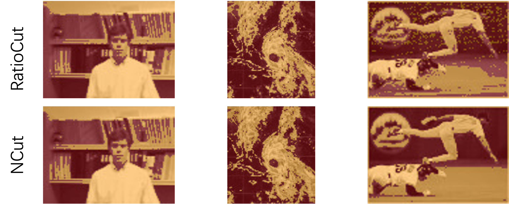

# GraphCut

Implementation of a Graph Partitioning algorithm using spectral clustering. [also a course project of "Matrix Analysis and Applications (矩阵分析与应用)" of DA, Tsinghua University]

The algorithm is described at https://home.cis.rit.edu/~cnspci/references/luxburg2007.pdf, which solve the problem of perceptual grouping and organization in vision by NCut and RatioCut.

The algorithm is mainly implemented on GPU using cuBLAS, nvJPEG and self-defined CUDA kernels. Main parts of the code include

* A efficient eigenvalues and eigenvectors solver based on Lanczos algorithm on GPU
* A simple K-means++ clustering for generating final segmentation on GPU
* Construction of graph Laplacian matrix and other pre-processing on GPU
* Visualization of segmentation result

